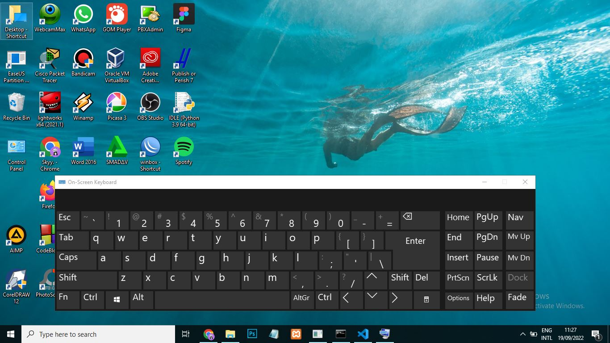

## **NAMA : WILLY NURGIAN**
## **NIM : 2110131210006**
---
## **MENGETAHUI KOMPONEN SISTEM OPERASI, LAYANAN SISTEM OPERASI, DAN SYSTEM CALL**

## KOMPONEN SISTEM OPERASI

Sistem operasi dapat dikatakan adalah perangkat lunak yang sangat kompleks. Sebuah Sistem Operasi adalah kumpulan program-program (software/perangkat lunak) yang membantu para pemakai komputer untuk berkomunikasi dengan komputernya. Hal-hal yang ditangani oleh sistem operasi bukan hanya satu atau dua saja, melainkan banyak hal. Dari menangani perangkat keras, perangkat lunak atau program yang berjalan, sampai menangani pengguna. Hal tersebut menyebabkan sebuah sistem operasi memiliki banyak sekali komponen-komponen tersendiri yang memiliki fungsinya masing-masing. Seluruh komponen yang menyusun sistem operasi tersebut saling bekerjasama untuk satu tujuan, yaitu efisiensi kerja seluruh perangkat komputer dan kenyamanan dalam penggunaan sistem operasi.

Oleh karena itu, penting bagi kita untuk mengetahui komponen-komponen apa saja yang ada di dalam sebuah sistem operasi, agar kita bisa mempelajari sistem operasi secara menyeluruh.

Tanpa satu saja dari komponen-komponen tersebut, bisa dipastikan sebuah sistem operasi tidak akan berjalan dengan maksimal. Bayangkan jika kita memiliki sistem operasi yang tidak memiliki kemampuan untuk menangani program-program yang berjalan sekaligus. Kita tak akan bisa mengetik sambil mendengarkan lagu sambil berselancar di internet seperti yang biasa kita lakukan saat ini.

Contoh sebelumnya hanya sedikit gambaran bagaimana komponen-komponen sistem operasi tersebut saling terkait satu sama lainnya. Mempelajari komponen sistem operasi secara umum dapat mempermudah pemahaman untuk mengetahui hal-hal yang lebih detail lagi tentang sistem operasi.

Dari berbagai macam sistem operasi yang ada, tidak semuanya memiliki komponen-komponen penyusun yang sama. Pada umumnya sebuah sistem operasi modern akan terdiri dari komponen sebagai berikut:

* Manajemen Proses.

* Manajemen Memori Utama. 
* Manajemen Sistem Berkas. 
* Manajemen Sistem M/K.
* Manajemen Penyimpanan Sekunder.  Manajemen Jaringan
* Proteksi dan Keamanan.

## LAYANAN SISTEM OPERASI
Sebuah sistem operasi yang baik menurut Tanenbaum harus memiliki layanan sebagai berikut:
1. Pembuatan Program
2. Eksekusi program.
3. Operasi I/O (pengaksesan I/O Device)
4. Sistem manipulasi berkas
5. Komunikasi
6. Deteksi error
7. Deteksi dan Pemberian tanggapan pada kesalahan
8. Efesiensi penggunaan sistem
9. Accounting

Pembuatan program, yaitu sistem operasi menyediakan fasilitas dan layanan untuk membantu para pemrogram untuk menulis program

Eksekusi program adalah kemampuan sistem untuk "load" program ke memori dan menjalankan program yang dikehendaki user maupun sistem.

Operasi I/O merupakan kegiatan dimana pengguna tidak dapat secara langsung mengakses sumber daya perangkat keras, sehingga sistem operasi harus menyediakan mekanisme untuk melakukan operasi I/O atas nama pengguna.

Sistem manipulasi berkas adalah kemampuan program untuk operasi pada berkas (membaca, menulis, membuat, dan menghapus berkas yang berupa file atau direktori).

Komunikasi adalah pertukaran data/ informasi antar dua atau lebih proses yang berada pada satu komputer (atau lebih).

Deteksi error adalah kegiatan untuk menjaga kestabilan sistem dengan mendeteksi "error", perangkat keras maupun operasi yang dilakukan.

Deteksi dan Pemberian tanggapan pada kesalahan, jika muncul permasalahan pada sistem komputer maka sistem operasi harus memberikan tanggapan yang menjelaskan kesalahan yang terjadi serta dampaknya terhadap aplikasi yang sedang berjalan.

Efesisensi penggunaan sistem, diantaranya:
* Resource allocator, yakni: mengalokasikan sumber-daya hardware maupun software ke beberapa pengguna atau mengalokasikan job yang jalan pada saat yang bersamaan ke beberapa komputer dalam jaringan.
* Proteksi sistem untuk menjamin akses ke sistem sumber daya yang aman, dikendalikan oleh sistem sehingga pengguna dikontrol aksesnya ke sistem).

Accounting adalah kegiatan merekam aktifitas pengguna, report pemakaian sumber daya. Sistem Operasi yang bagus harus mampu mengumpulkan data statistik penggunaan beragam sumber-daya dan memonitor parameter kinerja.

## SYSTEM CALL

System Call sendiri dapat diartikan sebagai penyedia antarmuka dari pelayanan-palayanan yang tersedia dengan Sistem Operasi. Umumnya System Call menggunakan bahasa C dan C++, meskipun tugas-tugas seperti hardware yang harus diakses langsung, maka menggunakan bahasa assembly

Definisi lain 

Layanan langsung sistem operasi ke pemrograman, disebut dengan system call atau API (application programming interface). System call adalah tata cara pemanggilan di program aplikasi untuk memperoleh layanan yang disediakan oleh sistem operasi. System call berupa rutin sistem operasi untuk keperluan tertentu yang spesifik. System Call untuk manajemen proses diperlukan untuk mengatur proses-proses yang sedang berjalan. Kita dapat melihat penggunaan system calls untuk manajemen proses pada Sistem Operasi Unix. Contoh yang paling baik untuk melihat bagaimana system call bekerja untuk manajemen proses adalah Fork. Definisi Fork adalah satu satunya cara untuk membuat sebuah proses baru pada sistem Unix. Fork membuat duplikasi yang mirip dengan proses aslinya, termasuk file descriptor, register, dan lainnya. Setelah perintah Fork, child akan mengeksekusi kode yang berbeda dengan parentnya. Bayangkan yang terjadi pada shell. Shell akan membaca command dari terminal, melakukan fork pada child, menunggu child untuk mengeksekusi command tersebut, dan membaca command lainnya ketika child terminate. Untuk menunggu child selesai, parent akan mengeksekusi system call waitpid, yang hanya akan menunggu sampai child selesai. Proses child harus mengeksekusi command yang dimasukkan oleh user (pada kasus shell). Proses child melakukannya dengan menggunakan system call exec.Dari ilustrasi tersebut kita dapat mengetahui bagaimana system call dipakai untuk manajemen proses.

Keuntungan dan kerugian menggunakan system call sama antarmuka untuk memanipulasi baik file dan perangkat adalah Setiap perangkat dapat diakses seolah-olah itu adalah file dalam file sistem. Karena sebagian besar penawaran kernel dengan perangkat melalui antarmuka file, relatif mudah untuk menambahkan device driver baru dengan menerapkan kode perangkat keras khusus untuk mendukung antarmuka file abstrak. Oleh karena itu, ini manfaat pengembangan baik kode program pengguna, yang dapat bewritten untuk mengakses perangkat dan file dalam samemanner, dan perangkat sopir kode, yang dapat ditulis untuk mendukung API yang didefinisikan dengan baik. Kerugian itu dengan menggunakan antarmuka yang sama adalah bahwa mungkin akan sulit untuk menangkap fungsi peralatan tertentu dalam konteks akses file API, sehingga baik mengakibatkan hilangnya fungsi atau kerugian kinerja. Beberapa ini dapat diatasi dengan penggunaan operasi ioctl yang menyediakan antarmuka tujuan umum untuk proses untuk memanggil operasi pada perangkat.
---

## KOMPONEN SISTEM KOMPUTER

### 1) MANAJEMEN PROSES

### **A. Manajemen Proses Via Task Manager**

Task manager adalah komponen Windows yang memungkinkanmu untuk melihat dan mengukur setiap proses yang berjalan di komputer atau laptopmu. Umumnya untuk mengakses task manager cukup menekan CTRL + ALT + DEL pada <i>keyboard</i> atau klik kanan di bagian <i>taskbar</i> dan lalu pilih <i>task manager</i>.

### Menggunakan Task Manager untuk Memulai Sebuah Aplikasi

Langkah-langkah berikut merupakan cara menggunakan Task Manager untuk memulai sebuah aplikasi Uraian dibawah ini menjelaskan langkah-langkah untuk untuk menghentikan aplikasi explorer.exe dan memulai kembali melalui Task Manager:

1. Jalankan aplikasi windows eksplorer
2. Tekan Ctrl+Alt+Del.
3. Klik start Task Manager.
4. Klik pada Tabulasi Processes.
5. Dalam kolom Image Name, cari nama proses explorer.exe.
6. Klik pada tombol End Task. Windows Explorer akan tertutup tetapi aplikasi yang lain tidak, termasuk Task Manager tetap terbuka.
7. Klik pada tabulasi Applications.
8. Klik pada tombol New Task. Kemudian akan muncul dialog box.
9. Didalam teks box yang terbuka, ketik explorer.
10. Klik Ok. Maka Windows Explorer akan terbuka.

### Menggunakan Task Manager untuk Menghentikan Aplikasi

Pada suatu saat suatu aplikasi tidak dapat dihentikan secara normal melalui tombol close yang terdapat pada jendela aplikasi dikanan atas atau melalui menu file exit . Uraian dibawah menjelaskan cara bagaimana menggunakan Task Manager untuk menghentikan secara paksa sebuah aplikasi, langkah-langkah tersebut antara lain ialah :

1. Tekan Ctrl + Alt + Del
2. Klik pada Start Task Manager
3. Didalam Task Area tersebut pilih lokasi dari sebuah aplikasi yang dalam keadaan “running” dan klik pada aplikasi tersebut.
4. Klik tombol End Task

### **B. Manage Process Via Windows Service**

Layanan Windows adalah aplikasi yang biasanya mulai ketika komputer di-boot dan berjalan dengan tenang di latar belakang sampai dimatikan. Secara tegas, layanan adalah setiap aplikasi Windows yang diimplementasikan dengan API layanan dan menangani tugas tingkat rendah yang memerlukan sedikit atau tidak ada interaksi pengguna. Untuk membuka Layanan Windows, Jalankan <i>services.msc</i> untuk membuka Manajer Layanan. Di sini Anda akan dapat memulai, menghentikan, menonaktifkan, menunda Layanan Windows.

### Menggunakan Task Manager untuk menghentikan dan me-restart sebuah service

Pada suatu saat pengguna ingin mengaktifkan ulang (restart) sebuah layanan aplikasi, tanpa harus membuang (remove) kemudian memasang kembali (install). Penggunan dapat menghentikan (stop) layanan suatu aplikasi sementara dan atau mengaktifkannya (start) kembali menggunakan aplikasi tast manager. Berikut adalah langkah-langkah untuk menghentikan dan memulai kembali sebuah service print spooler melalui Task Manager :

1. Tekan Ctrl+Alt+Del
2. Klik Start Task Manager, Klik tab Services
3. Pada kolom Description, “scroll” kebawah ke service Print Spooler, klik kanan pada service tersebut kemudian pilih Stop Service.
4. Bergantung pada konfigurasi keamanan, pengguna mungkin menerima pesan “access-denied”. Jika hal ini terjadi maka klik Print Spooler kembali.
5. Klik tombol Services pada kanan bawah.
6. Jika window UAC terbuka, klik Yes.
7. Pada tampilan utama, scroll kebawah ke Print Spooler, klik kanan pada service tersebut dan pilih Stop.
8. Untuk menjalankan ulang service tersebut, ikuti langkah-langkah yang sama diatas, tapi ketika klik kanan pada service Print Spooler dan pilih Start

### **C. Manajemen Pengaturan Via Windows Control Panel**

Control panel merupakan bagian dari Microsoft Windows sebagai alat manajemen (<i>management tools</i>) yang memungkinkan pengguna untuk mengelola tugas dan memodifikasi pengaturan pada perangkat keras atau perangkat lunak yang ada didalamnya.
Cara mengakses control panel cukup melalui fitur <b>search</b> yang sudah disediakan.

### B) MANAJEMEN MEMORY UTAMA
### **Manajemen Memory Pada Windows Menggunakan Task Manager**

<b>Deskripsi Manajemen Memori:</b>

1. Manajemen memori adalah Tugas yang paling penting dan paling kompleks dari sistemoperasi.
Memori adalah sumber daya Komputer yang sangat penting, sehingga dikelolasangat hati-hati oleh sistem operasi. CPU berhubungan dengan waktu eksekusi( runningtime/CPU time), Memori berhubungan dengan ruang dan alamat ( space dan address).
2. Memori sebagai pengingat dan penyimpan informasi yang berupa data dan program.
Manajemen memori berkaitan dengan memori utama sebagai sumber daya yang harusdialokasikan dan dipakai bersama diantara sejumlah proses yang aktif.
3. Manajemen memori berkaitan juga dengan usaha agar pemrogram atau proses tidakdibatasi oleh kapasitas memori fisik yang terdapat pada sistem komputer.

Manajemen Memori Terdapat 2 (dua) manajemen memori yaitu:
1) Manajeman memori statis, Dengan pemartisian statis, jumlah, lokasi dan ukuran proses dimemori tidak beragam sepanjang waktu secara tetap.
2) Manajemen memori dinamis Dengan pemartisian dinamis , jumlah, lokasi dan ukuran proses dimemori dapat beragam sepanjang waktu secara dinamis.

### **Manajemen Memory Pada Windows Menggunakan Disk Management**

Disk management adalah Utilitas Microsoft Windows yang Pertama kali Diperkenalkan di Windows XP sebagai pengganti dari Fdisk Command. Fasilitas Disk Management ini Memungkinkan User untuk Melihat dan Mengatur Disk Drives yang Terpasang di Komputer mereka dan Partisi-partisi yang terasosiasi dengan Drive-drive tersebut. Seperti yang bisa dilihat pada Gambar dibawah ini, setiap Drive akan ditampilkan disertai dengan Layout, Type, File System, Status, Capacity, Free Space, % Free, dan Fault Tolerance.

Cara membuka disk management pada windows :
1. Buka Control Panel
2. Klik dua kali pada Administrative Tools jika Control Panel anda masih Tampilan Classic atau Klik Performance and Maintenance dan kemudian Administrative Tools jika Tampilan Control Panel dalam Mode Kategori. Jika anda tidak memiliki Akses Admin terhadap komputer maka Opsi ini tidak dapat digunakan.
3. Apabila sudah berada di Jendela Administrative Tools, Klik dua kali Computer Management kemudian Klik Disk Management pada Storage Section. 

### C) Sistem Proteksi Windows
### **Proteksi Menggunakan Windows Defender**

Windows Defender adalah sebuah fitur atau software proteksi atau perlindungan yang disediakan oleh Windows untuk melindungi komputer atau laptop dari virus, malware maupun ancaman lain yang menyerang komputer. Ketika Install Windows di komputer atau laptop, Windows memang memasukkan juga software atau fitur mirip antivirus yang secara otomatis ada di sistem untuk mengamankan komputer.

Meski Windows Defender adalah antivirus gratis dari Microsoft, namun tidak berarti fitur yang ditawarkan Windows Defender kualitasnya gak bagus. Kualitas dari Windows Defender untuk sebuah antivirus gratis yang “bawaan” Windows terbilang mumpuni. Berikut beberapa fitur Windows Defender:

* Real Time Protection yang berguna untuk menemukan serta mencegah program berbahaya ketika sudah terinstal di komputer ataupun yang sedang berjalan.
* Cloud Delivered Protection yang menjamin keamanan komputer atau laptopmu berkat adanya akses ke pusat data proteksi, jadi kamu gak usah khawatir karena akan aman dari berbagai serangan virus, malware, trojan ataupun hal berbahaya lainnya yang mengancam komputermu.
* Automatic Sample Submission yang memberi kalian akses untuk berbagi informasi ke pihak Microsoft kalau terdapat program yang dianggap berbahaya sehingga bisa ditangani.
* Tamper Protection yang berguna untuk memastikan tidak ada program berbahaya di sistem yang ingin merubah atau merusak berbagai pengaturan penting di komputermu seperti misalnya menonaktifkan antivirus, mengubah setingan Windows dan yang lainnya.
* Ransomware Protection yang berfungsi untuk menjamin berbagai data yang ada di komputermu aman dari berbagai serangan virus, malware ataupun program berbahaya yang ingin mengunci, mencuri, mengubah atau bahkan merusak data tersebut.

### **Proteksi Tambahan Menggunakan Smadav**

4 Fungsi utama Smadav :

1)Proteksi tambahan untuk PC (komputer), kompatibel dengan sebagian besar antivirus lainnya. 

Banyak antivirus yang tidak bisa di-install bersama antivirus lainnya, ini dikarenakan antivirus-antivirus tersebut didesain untuk proteksi utama pada komputer anda. Berbeda dengan Smadav yang di-desain sebagai proteksi tambahan, sehingga kemungkinan besar akan kompatibel dan dapat berjalan dengan baik walaupun sudah ada antivirus lain di komputer anda, dalam hal ini Smadav berfungsi sebagai lapisan pertahanan kedua. Smadav mempunyai caranya sendiri (behavior, heuristic, dan whitelisting) dalam mendeteksi dan membersihkan virus sehingga akan lebih meningkatkan keamanan di komputer tersebut. Karena penggunaan resource Smadav yang sangat kecil, Smadav tidak banyak menambah beban kinerja komputer anda dalam penggunaannya. Jadi, dengan perpaduan proteksi antara Smadav dan antivirus yang sudah ter-install di komputer anda akan semakin memperkuat pertahanan komputer anda dari infeksi virus.

2)Proteksi tambahan untuk USB Flashdisk

USB Flashdisk adalah salah satu media penyebaran virus terbesar. Smadav mempunyai teknologi khusus untuk pencegahan virus yang menyebar melalui USB Flashdisk. Smadav mempunyai cukup banyak signature virus yang menginfeksi flashdisk, dan mempunyai kemampuan khusus untuk mencoba mendeteksi sebagian virus baru di flashdisk yang belum ada di database Smadav. Tidak hanya pencegahan, Smadav juga akan mencoba menghapus virus dan mengembalikan file yang disembunyikan virus di USB Flashdisk tersebut

Smadav cukup baik digunakan untuk komputer yang jarang atau bahkan tidak terkoneksi ke internet. Smadav tidak perlu melakukan update sesering antivirus lainnya. Smadav tidak terlalu tergantung pada signature/database virusnya, tapi lebih bergantung kepada teknik deteksi behavior, heuristic, dan whitelisting.

3)Antivirus yang ringan

Smadav mempunyai kelebihan dalam hal ukuran instalasinya yang sangat kecil (dibawah 10 MB) dan Smadav sangat sedikit menggunakan internet ketika aktif di PC. Smadav juga hanya memerlukan sumber daya (resource) komputer yang sangat kecil. Sebagian besar pemakaian saat Smadav aktif hanya memerlukan sedikit memori (biasanya di bawah 20 MB) dan penggunaan CPU yang kecil. Dengan penggunaan yang sangat kecil seperti ini, Smadav tidak akan begitu mempengaruhi atau memperlambat pekerjaan anda yang lainnya. Dan anda juga masih tetap dapat meng-install antivirus lainnya yang bisa bersanding dengan Smadav untuk melindungi komputer anda.

4)Cleaner dan tools untuk membersihkan virus

Smadav dapat membersihkan komputer anda dari virus baik secara otomatis ataupun manual menggunakan tools yang disediakan Smadav. Smadav juga dapat memperbaiki registry yang sudah dirusak/diubah oleh virus. Beberapa tools yang dapat digunakan pada Smadav Pro untuk membersihkan virus secara manual yaitu :

* One-Virus By-User, untuk menambahkan file virus dan membersihkannya secara manual
* Process Manager, untuk mengatur proses dan program yang berjalan di PC.
* System editor, untuk memperbaiki pengaturan sistem yang diubah virus.
* Win-Force, untuk membuka program manajemen sistem di Windows.
* Smart-Lock, untuk memperkuat pertahanan drive komputer dari infeksi virus.

### D) Command-Interpreter System

Suatu sistem operasi akan menunggu instruksi dari command driven atau pengguna. Programnya akan membaca sejumlah instruksi dan juga akan mengartikan control statements yang biasanya juga disebut sebagai control-card interpreter, command-line interpreter, dan UNIX shell.

Daftar Tugas(<b>Tasklist</b>) adalah utilitas yang mencantumkan proses yang sedang berjalan baik di komputer lokal atau di mesin jarak jauh. Anda dapat dengan cepat memeriksa proses mana yang berjalan di latar belakang, dan kemudian menghentikan proses tersebut; kita dapat menggunakan perintah Taskkill untuk membunuhnya

## LAYANAN SISTEM OPERASI

### **1. User Interface**

User interface atau UI adalah tampilan yang meliputi bentuk, warna, dan tulisan yang didesain semenarik mungkin. Nah, karena user interface adalah tampilan sebuah produk dilihat oleh pengguna, maka harus mampu tampak menarik. 

Setelah masuk, kamu akan dialihkan menuju desktop yang merupakan gambaran umum dasar PC kamu. Kamu dapat membuka semua file, folder, dan aplikasi dari sini. Kamu akan melihat beberapa ikon dan Taskbar di bagian bawah layar yang memiliki beberapa ikon lainnya serta tombol Start yang berada dibagian kiri bawah layar.

### **2. Execute Program or Application**

Untuk mengaktifkan atau menonaktifkan alias eksekusi aplikasi di Windows 10, gunakan langkah-langkah berikut:

1. Buka Pengaturan.

2. Klik Aplikasi.

3. Klik Aplikasi & fitur di sebelah kiri.

4. Klik halaman Manage App execution aliases di sisi kanan.
5. Terakhir, kamu bisa matikan tombol sakelar untuk aplikasi dengan nama yang sama.

### **3. I / O Operation**

Unit masukan (input) adalah unit luar yang digunakan untuk memasukkan data dari luar ke dalam mikroprosesor, contohnya data yang berasal dari papan ketik (keyboard). Sementara unit keluaran (output) biasanya digunakan untuk menampilkan data, atau dengan kata lain untuk menangkap data yang dikirimkan oleh mikroprosesor, contohnya data yang akan ditampilkan pada layar komputer atau pencetak.

## SYSTEM CALL 

### **TASKLIST**

Tasklist merupakan perintah CMD yang bisa digunakan untuk menampilkan informasi aplikasi yang sedang berjalan di komputer kamu. 

### **MKDIR**

Perintah mkdir merupakan perintah atau code CMD yang bisa kamu gunakan untuk membuat folder. Cara penggunaannya cukup mudah, ketik mkdir (spasi) nama folder, kemudian Enter. Fungsi dir digunakan untuk menampilkan file dan folder aktif. Misalnya kamu berada pada folder USER, maka daftar folder dan file yang ditampilkan adalah yang berada pada folder USER.

### **DISKPART**

Perintah diskpart merupakan perintah CMD yang dapat digunakan untuk mengelola partisi harddisk. Diskpart merupakan salah satu fungsi yang ditawarkan Windows untuk memudahkan pengguna dalam mengelola harddisk. 

Perintah ini bertujuan untuk mengelola pembagian ruang penyimpanan di harddisk. Jika anda belum familiar dengan fungsinya, sangat disarankan untuk menghindari penggunaan fungsi diskpart karena adanya risiko kehilangan data.

Tapi jika kamu masih penasaran, kamu dapat menggunakan fungsi ini dengan mengetikkan diskpart di jendela CMD. Setelah menekan Enter, maka satu jendela CMD tambahan akan.

Di jendela baru ini, kamu dapat mengetikkan beberapa perintah, salah satunya adalah list disk yang akan memunculkan berbagai partisi harddisk kamu beserta jenisnya.

Fungsi select disk digunakan untuk memilih disk yang ingin diketahui, list partition untuk melihat isi partisi dalam disk yang dpilih tadi.